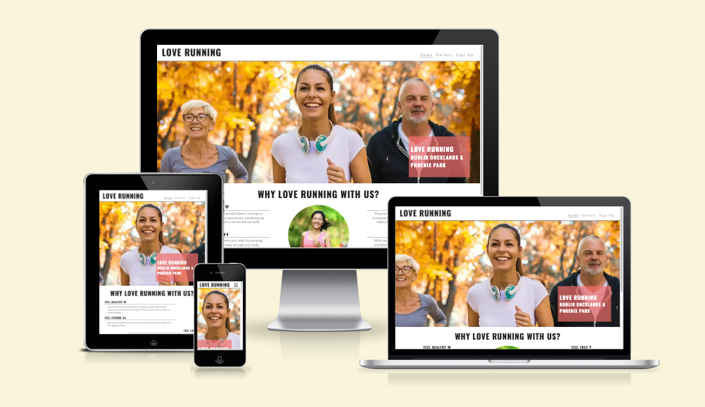
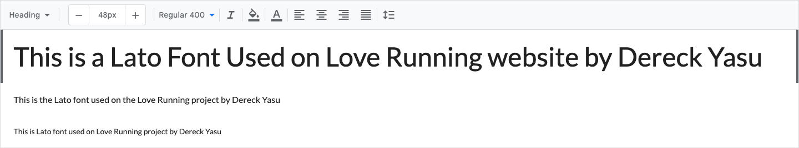
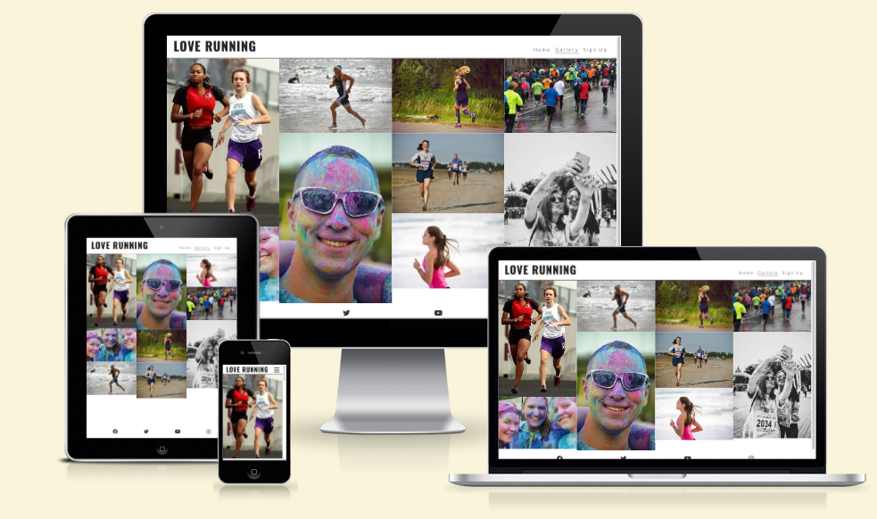
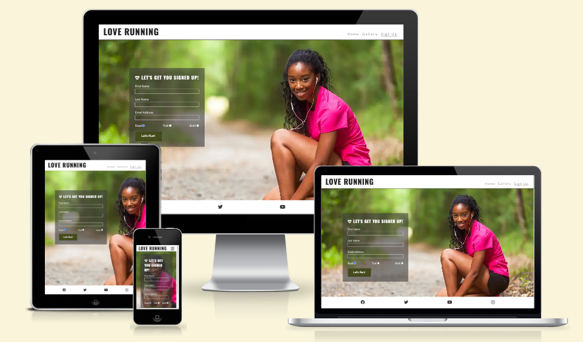

# LOVE RUNNING BY DERECK YASU

Welcome to Love Running by Dereck - a portfolio website for html. I have built websites before but with wordpress and this is my first website fully on code HTML and CSS.

Love Running website was built in html and css and it is responsive on all devices. As a visitor you can view a gallery of previously sucessful runs from our athletes in the city, beach and mud runs, with a call-to-action to get in touch with the use of a form.

TO VIEW THE LATEST WEBSITE
[You can see the live website here.](https://drayyblacc.github.io/loverunning)

ALL GITHUB PAGES
[You can see the GitHub code pages here.](https://github.com/Drayyblacc/loverunning)

---

## CONTENTS

- [LOVE RUNNING BY DERECK YASU](#love-running-by-dereck-yasu)
  - [CONTENTS](#contents)
  - [User Experience (UX)](#user-experience-ux)
    - [User Stories](#user-stories)
      - [Client Goals](#client-goals)
      - [First Time Visitor Goals](#first-time-visitor-goals)
      - [Returning Visitor Goals](#returning-visitor-goals)
      - [Frequent Visitor Goals](#frequent-visitor-goals)
  - [Design](#design)
    - [Colour Scheme](#colour-scheme)
    - [Typography](#typography)
    - [Imagery](#imagery)
  - [Features](#features)
    - [General features on each page](#general-features-on-each-page)
      - [Home Page](#home-page)
      - [Gallery](#gallery)
      - [Contact](#contact)
      - [Congratulations](#congratulations)
    - [Accessibility](#accessibility)
  - [Technologies Used](#technologies-used)
    - [Languages Used](#languages-used)
    - [Frameworks, Libraries \& Programs Used](#frameworks-libraries--programs-used)
    - [Deployment](#deployment)
    - [Local Development](#local-development)
      - [How to Fork](#how-to-fork)
      - [How to Clone](#how-to-clone)
  - [Testing](#testing)
  - [Credits](#credits)
    - [Code Used](#code-used)
    - [Content](#content)
    - [Media](#media)
    - [Acknowledgments](#acknowledgments)

---

## User Experience (UX)

### User Stories

Love Running by Dereck is a website made to invite runners to join the Dublin club for city, beach and mud run to help the client to be feel more healthy, feel strong, feel free and get social. With Love Running website it helps them to be more accessible online and get more potential runners.

#### Client Goals

- For potential runners to give information about the club scheduled days and times and also links to their social media platforms.
- To showcase previously made runs so that customers can see some of the made runs.
- To allow visitors to the site to get in touch with Love Running with an enquiry.
- With the information captureing contact form it allows visitors to put down their details so the Love Running team can contact them easily.
- To be able to see and do all of the above on any device, whether a mobile phone or a desktop computer.

#### First Time Visitor Goals

- I want to see what their runs look like.
- I want to see where they run.
- I want to get in touch for more information or enquire before joining.
- I want to find information easily without too many clicks.
- I want to find out more on their Social Media pages.

#### Returning Visitor Goals

- I want to have another look at the gallery for inspiration.
- I want to follow up my previous viewing of the site to now get in touch with Love Running club.

#### Frequent Visitor Goals

- I want to see the times and places for the run happening throughout the week.
- I want to recommend Love Running to my friends, collegues and family.

---

## Design

### Colour Scheme

The colour scheme for the website come from that were added by the Project Tutor of Code Institute. The idea was to keep the website looking colourfull and beautiful, whilst still easy to read.

### Typography

The fonts used on the website was chosen to make sure text is clear in all devices sizes

Google Fonts was used to import both fonts:

- Lato is the font used on all of the text on the website. This include both a bolder and a lighter font weight.

Font Awesome is also used for bullet points and the home index page and sign up page on the website.

### Imagery

The imagery on this website is all photography, with the odd Font Awesome icon appearing on home page and sign up page. The photos were from Code Institute and some were from me, only the ones on README.

## Features

The Love Running website contains 3 pages - home page, gallery, sign up and congratulation page. All three pages can be accessed via the navigation menu on the right header of all pages and on the click of the hamburger icon on smaller devices or phones. After the client puts their information on the form and click on the Lets Run Button it opens a congradulations page with the data sent from customer being first name, last name, email, email address and running preference.

### General features on each page

- 3 pages pages show the Love Running text on the left of the page and a responsive navigational bar on the right, in a header at the top of the page.
- In a footer at the bottom of the page are the social media links for Facebook, Twitter, Youtube & Instagram. These are shown as icons.
- A favicon of the logo appears in the browser tab.
****- In the bottom right corner, as you start to scroll down, an arrow appears which enables the user to get back to the top of the page.

#### Home Page

The home page features a bright hero image of three people running underneath the navigational header. There is some welcome text on the far right for bigger screens and in the middle for phone and smaller devices, which introduces the Love Running Club and where they're located.

The next section is broken down into images and text, to give information about why people love running with Love Running club and a lady running, and gives the website users ideas as to what tto expect.

Just above the footer there is a section showing day, time and place of the run.

#### Gallery

In this pages they are a few photos added there for the website viewer to see previous club runs and athletes.

#### Contact

On this page they is a background image and color to make the form shine out bright and easy to read and fill. With the contact form thats when they will fill in their information to enquire and all fields are required before the user clicks on submit and users do get alerted when they haven't filled in these required fields.

#### Congratulations

A simple page with different styling as the website. The form elements have been removed and replaced with a 'Congratulations' message.

### Accessibility

I have tried my best to ensure the site has been made as accessible as possible by:

- Using simple HTML.
- Using alt attributes on images.
- Adding aria-labels for screen labels.
- Using colour contrasts between the text and background.
---

## Technologies Used

### Languages Used

HTML and CSS was used to create this website.

### Frameworks, Libraries & Programs Used

- [Codeanywhere](https://app.codeanywhere.com/) -  platform cloud IDE to deploy workspace environment to Github.
- [Visual Code Studio](https://balsamiq.com/) - When codenaywhere had issues i pulled out my code for offline environment to continue working.
- [Github](https://github.com/) - to store and dislay all files and assets for the website.
- [Google Fonts](https://fonts.google.com/) - to import the fonts used on the website.
- [Font Awesome](https://fontawesome.com/icons) - to use icons on the website.
- [Google Dev Tools](https://developer.chrome.com/docs/) - to troubleshoot using inspect, test and solve issues with any styling.
- [W3C Markup Validator](https://validator.w3.org/) - to check the source code of my html files for any bugs.
- [W3C CSS Validator](https://jigsaw.w3.org/css-validator/) - to check the source code of my css file for any bugs.
- [Tiny PNG](https://jigsaw.w3.org/css-validator/) - to optimise images for the website.
- [Am I Responsive?](https://ui.dev/amiresponsive?) - to show the website on different responsive devices.

### Deployment

I used Github to deploy the live website. To deploy a website on Github, follow these steps:

1. Log in to Github - or set up a new account.
2. Find the repository for [Love Running by Dereck](https://github.com/Drayyblacc/loverunning).
3. Click on 'Settings' along the top.
4. Click on 'Pages' in the left hand side navigation bar.
5. In the 'Source' section, make sure 'Deploy from a branch' is selected. Choose 'main' and 'Root' from the drop down menus and click Save.
6. Your live site is now deployed and can be viewed using the link provided.

### Local Development

#### How to Fork

To fork a repository on Github, follow below steps:

1. Log in to Github - or step up a new account.
2. Click on the repository for [Love Running](https://github.com/Drayyblacc/loverunning).
3. Click the Fork button in the top right corner.

#### How to Clone

To clone a repository on Github, follow below steps:

1. Log in to Github - or step up a new account.
2. Find the repository for [Love Running](https://github.com/Drayyblacc/loverunning).
3. Click on the code button, select whether you would like to clone with HTTPS, SSH or GitHub CLI and copy the link shown.
4. Open the terminal in your code editor and change the current working directory to the location you want to use for the cloned directory.
5. Type 'git clone' into the terminal and paste the link you copied in step 3. Press enter.

- - -

## Testing

I have seen that its hard to keep in mind all text errors so i will need to start my testing file earlier or just at the beginning of the project so i will building and adding to the testing file up until the end of the project however i fixed a lot of minor issues through out the code and sometimes my code would not work and had to take it offline to test it and discoved that some times CODEANYWHERE would not push my code to Github and had to be trying again and again but unfortunately i have forgotten the list of the errors. 
I therefore created a Testing file, so that you can find some few tests and fixes I did manage to remember.
  
[TESTING.md file](TESTING.md)

---

## Credits

### Code Used

- [W3Schools](https://www.w3schools.com/howto/howto_css_transition_hover.asp) - helped me style and create the form.
- [W3Docs](https://www.w3docs.com/tools/code-editor/3033) - helped me to increase the checkbox size in my signup form.
- I also used the [Love Running](https://github.com/Code-Institute-Solutions/love-running-v3/tree/main/8.1-testing-and-validation) project from Project Tutor created by [Code Institute](https://codeinstitute.net/) to help with some code.

### Content

All content used on the site was written by Dereck Yasu and Tutor from Code Institute.

### Media

Most of the photos were provided on the Project 1 tutor of Code Institute and a few from me that are only on this file. Icons used on the website are from Font Awesome.
  
### Acknowledgments

I would like to thank and appreciate the following people that hepled me throughout the project.

- My girlfriend for alway believing in me to finish the project in time.
- My Code Institute  [Tutors](https://www.codeinstitute.net/).
- Rachael for helping me and giving me a structure for my readme.
- Members of the Code Institute Slack. Some managed to respond to my questions and that helped me
- [Scott Clarke](mailto:Scott.clarke@codeinstitute.net) from Code Institute who signed me up to the course! I hope you like my first project!
