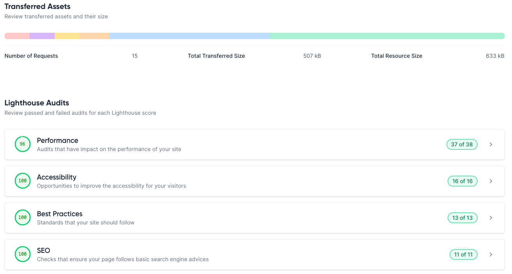
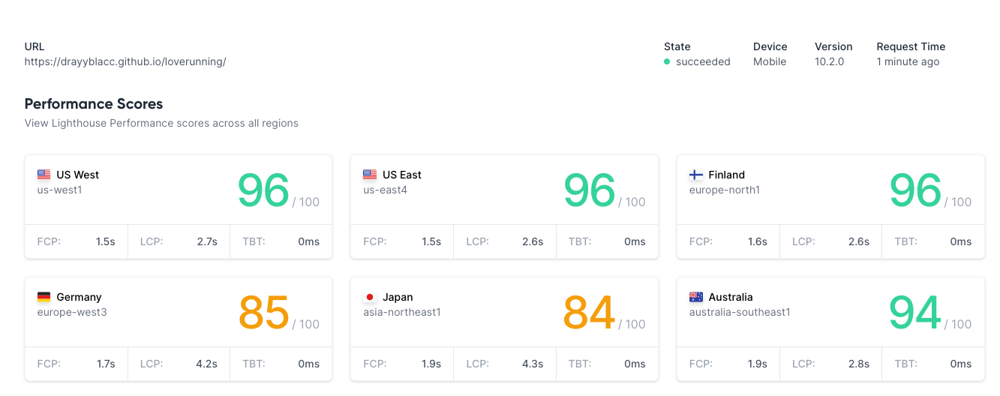

# LOVE RUNNING BY DERECK YASU - TESTING

LIVE SITE

[You can view the live site here.](https://drayyblacc.github.io/loverunning)

## CONTENTS

- [LOVE RUNNING BY DERECK YASU - TESTING](#love-running-by-dereck-yasu---testing)
  - [CONTENTS](#contents)
  - [AUTOMATED TESTING](#automated-testing)
    - [W3C Validator](#w3c-validator)
    - [Lighthouse](#lighthouse)
    - [Results](#results)
    

 Even if I have been testing the site throughout the development, I made a huge mistake of not documenting all the bugs I have fixed from the start. I will learn to do this on my other next projects!

Chrome Developer Tools was very useful in being able to pinpoint the code that needed tweaking to get elements working.

I used the W3C Validator to check my html and css source code, and also [LightHouse Metrics](https://lighthouse-metrics.com) website to test the performance and accessibility. These are explained in more detail below.

- - -

## AUTOMATED TESTING

### W3C Validator

[W3C](https://validator.w3.org/) was used to validate the source code for both the html and css on all pages of the website.

The first check revealed a few errors and unfortunately i do not remember all of them as i did not capture this to my Testing file.

- [index.html]
 - No screenshot, however there was a two closing i tags on all four icons on index page even though they did not cause ony error on the website the validator managed to pick that up and this was removed.
- - -

### Lighthouse

I used Lighthouse Metrics website tools to test the performance, accessibility, best practices and SEO of the website.

### Results

Desktop results had good high look - in all images and text content. Happy to see Accessibility is 100.

- Full Website Audit 
  

- Audit 2
  
